# Analysis

## The problem

When talking to an individual or a group of people, humans naturally assume that the members present are the only ones aware of what is being said. Online, this is not always the case; malicious individuals are able to perform man-in-the-middle attacks and 'hear' everything being said or intercept the server managing the communications to possibly reveal messages to third parties.

With the growing importance of technology in our world, it is important that people are able to accomplish their tasks without a lingering fear that someone might be listening in. There are several means by which people can communicate online but most of them either don't implement end-to-end encryption or don't make it convenient for the user to take advantage of it.

### Current solutions

#### Unencrypted

- SMS

SMS is a basic set of protocols with no built-in support for encryption, extreme character limits, and no rich text formatting. Additionally, it is carrier-dependent and declining in usage. All of this considered, I believe it is a poor option for text messaging in general and secure communication even more so. Users are likely to be frustrated by the lack of features and convenient security provided in other applications.

An app called Silence offers the ability to encrypt SMS messages but it does not solve the inherent problems with the system. To use it, all parties need to have the app installed or else they will see garbled text. Since this idea isn't standardised across SMS clients, those unfamiliar with encryption will be confused and likely put off from using it.

#### Encrypted but with some disadvantages

- iMessage: uses end-to-end encryption but can only be used between Apple devices
- Facebook Messenger: encrypted but feature not enabled by default
- Telegram: same Facebook Messenger
- Encrypted email: difficult for the average user to set up


Some attempts at creating a secure messenger have been quite successful: iMessage is both end-to-end encrypted and simple to use. Unfortunately, it comes with the major disadvantage of only being usable on Apple products.

Both Telegram and Facebook Messenger offer end-to-end encryption through a 'secret chat' feature. However, these are not enabled by default so many users either won't know about their existence, what they do, or will simply forgo using them for convenience.

Email itself is not an encrypted system by design but PGP is often used to provide asymmetric encryption. This approach has seen moderate success and is largely held back by obscurity and how cumbersome it is to use; users must generate their own key pair and manually distribute their public keys to people they wish to talk to. If a user does not understand the system, they can share the wrong key and nullify all security. The high barrier for entry restricts email encryption mostly to technical users. Some clients try to make this easier but due to the nature of email it is unlikely to ever be universally accessible.

#### Encrypted and easy to use

- Signal
- WhatsApp

The Signal protocol is perhaps the industry standard for secure messaging; it is used by both WhatsApp and Signal itself. In addition to using a mixture of cryptographically secure algorithms, it also offers perfect forward secrecy which means that, if a secret key is compromised at any point in time, all past conversations will remain confidential.

The Signal app itself is does not require the user to understand how encryption works in order to use it, providing a good user experience. In addition, it is open source which allows security experts to independently scrutinise it for issues.

While WhatsApp's end-to-end encryption is easy to use, it collects a lot of personal user data and is run by Facebook, which many users consider untrustworthy. Since those looking to keep their messages private often desire the same for their personal data, WhatsApp is not a desirable option for everyone.

As you can see, good encrypted messaging apps do exist but there are currently quite few of them. My app aims to be one of the options to provide users with an uncomplicated experience.

## The user

Although the goals of this program will likely appeal to a broad audience, it is specifically aimed at non-technical users who wouldn't otherwise know how to send messages securely. I believe that other potentially interested parties like power users and organisations likely already have the knowledge and resources available to achieve these goals by other means.

The application will contain some features catered towards more advanced users (should they wish to use them) but the primary focus will be to make the experience as simple as possible for a new user.

### The interview

This is an interview with Jack. He works as an architect and does not have a technical background with regards to computers. After hearing news about data breaches and controversial privacy policies of companies whose products he uses, he is interested in how he can keep conversations confidential online.

---

What is your primary method of communicating with others online?

> I use different apps depending on the person I'm talking to. I think Facebook Messenger is probably the main one.

> I use many different apps in order to communicate with my clients. For conversations with family and friends, I think I mostly use Facebook Messenger.

What other methods do you use or have used in the past?

> Lots. WhatsApp, various social medias, and even SMS when I have to. I don't have much of a preference, personally.

Have you ever sent messages or media that you would like to remain private?

> Yes, of course. I frequently sign non-disclosure agreements for work projects and I'm sure everyone involved would like those messages to stay where they are.

Have you ever felt worried about a third party seeing your messages?

> Yeah, it concerns me. With all this user data getting leaked I feel like its just a matter of time before it happens to me.

Have you ever taken any steps to make your communications safer or more secure?

> Well, I've thought about it but I'm not really sure where to get started. Most things seem too complicated, both for me and everyone else who I'd be using them with.

If so, describe your experience.

> I tried to get some of my contacts to use the 'secret chat' feature in Facebook Messenger. The problem is that it's too much hassle to turn on every time and I often even forget that it's an option.

What devices or platforms do you use to communicate on?

> My phone, which is Android, and my Windows laptop. I use my phone more but it's a lot of usage on both still.

---

### Objectives

I intend to develop a new messaging app that will make sending messages between users as frictionless as possible. These are the criteria that it must achieve:

- Messages must be end-to-end encrypted
- Encryption must be enabled by default
- Sending an encrypted message should require minimal technical knowledge and effort
  - Registering and sending a message should not take more than two minutes of using the app
- Be usable on all major platforms (iOS, Android, Windows, macOS, Linux)

During the interview, Jack stated that they sometimes wanted their messages to remain secret but the people they communicate with wouldn't be interested. The obvious solution to this is encryption but since switching between encrypted and unencrypted messaging in the middle of a conversation can be cumbersome, it makes the most sense to enable it by default; the user will be able to take advantage of it without having to actively consider enabling it. Likewise, their peers, who may not care as much about secrecy, won't have to put in effort to cooperate.

One of the major problems the user expressed is secure messaging being "difficult". Addressing this issue is important because privacy is not usually a priority for users but rather something that they desire on occasion. As a result, users can easily give up on it when the process requires too much effort. A good encrypted messenger should make this simple so that the users determination does not run out before they are able to find a solution.

Since the program is used for communications, it should aim to maximise the amount of people that are able to access it. Jack also said that he uses multiple devices often. The solution to this is to make the app cross-platform so that it is accessible to nearly anyone. Mobile operating systems are a priority due to the nature of the program but many other apps offer a desktop client or web interface as well.

Unfortunately, making an app directly for iOS would be difficult since Apple's requirements for publishing an application to the App Store are very high and they offer no simple way to sideload programs. Hence, I will likely create a web interface for my app to get around this issue.

## Investigating other projects

### WhatsApp


- Bar at the top allowing users to exit, see the group name, and use additional options
- Simple strip at the bottom including a text box and a voice-messaging icon
- When the text box is empty, some faded text instructs the user on what to do with it
- Messages are aligned left or right depending on sender

## Modelling

### Architecture

A centralised server will be used to simplify data management and allow communications to happen easily regardless of the specific client.



The server will be written in the Rust programming language due to its strict memory checking features, good performance, and multithreading support. I believe these properties complement the server's role well since speed and reliability is crucial for such a component. The client will be written in Dart because this is the language used by the Flutter toolkit. When the program is compiled, this code will be converted to each platform's native language (Java/Kotlin for Android, Swift for iOS, and JavaScript for the web).

### Operation

Once the user opens the client, they are met with a login screen that asks them for their email and password. There are two buttons below that allow the user to either login or register for a new account, the latter option prompting more options to appear.

The user can see whether their input is valid or not based on the outline of the input box. If it turns red, an error message will appear and tell the user the mistake they made. This can happen if an invalid email is used upon registration or if the user tries to login with an account that doesn't exist.

On the server side, a TCP listener is bound to port 63100 (not used in any major software). Incoming connections are accepted asynchronously and maintained by continuously polling the client (every 500 ms, by default). If the client starts returning null responses, the connection is severed and the polling stops. Additionally, the server connects to a PostgreSQL database, which it uses to store persistent user, message, or conversation data.

Immediately after the user opens the app, a TLS connection is made with the server and the lifespan of this connection represents a single 'session' for which a user is logged in. A single connection simplifies communication by easily allowing it to work full duplex; the client and the server both send messages via the same 'pipe', and the server does not need to locate the user to communicate with them (which might be difficult since users can move around an connect from different networks) since the client always initiates them.

Initially, the connection is 'unauthorised'. This means that the only actions the user can take are logging in and registering for a new account. All other requests will be rejected at the server level, preventing alternative clients from bypassing the system. Once a client is logged in, the connection becomes authorised under their user, allowing new actions to be taken without additional authentication.

Data sent over the network follows a custom JSON-based protocol which specifies a function along with necessary operands:

```
{
  'function': 'CREATE USER',
  'users': [{
    'email': 'john@example.com',
    'password': 'p@$$w0rd',
    'publicKey': 'VGhlIEVjaG8gc2VjdXJlIG1lc3Nlbmdlcg=='
  }]
}
```

The function is made up of an operation and a target. There are five operations, and four of them correspond to a CRUD action (CREATE, READ, UPDATE, DELETE). The last one is VERIFY, which is used to authenticate users when they log in. Possible targets include USER, CONVERSATION, and MESSAGE.

JSON was chosen because of its ubiquity as a data exchange format. Base64 is used to encode binary data because it is more concise than a byte array (less data to transfer over the network) and consists only of ASCII characters.

### Process

#### Client

##### Sending

1. Exchange key pairs
    1. User1 generates a key pair
    2. User2 generates a key pair
    3. User1 sends their public key to User2
    4. User2 sends their public key to User1
2. Establish a session key
    1. Local private key combined with remote public key to create session key
3. Compose message
4. Encrypt the message
    1. User1 writes a message
    2. Create a signature
        1. Message contents are hashed to produce a digest
        2. User1 encrypts the digest using their private key
    3. Message encrypted using the session key
    4. Encrypted message and digest are bundled together
5. Transmit message to server

##### Receiving

1. Receive message
    1. User2 decrypts message using the session key
2. Verify signature
    1. User2 decrypts digest using User1's public key to produce first digest
    2. Message contents hashed to produce the second digest
    3. Check if digests match
3. Display message
    1. If signature could not be verified, display a warning to the user

#### Server

1. Receive message
2. Interpret client request
  - If registering, add user information to database
  - If receiving a message, add it to database and relay it to user
3. Transmit message to User2

### API

#### VERIFY USERS

Verifies a user for the current connection. Almost all requests require this to be run first. Unlike most other functions, only one user can be specified here.

##### Request

- user
    - email
    - password

##### Response

- success

#### CREATE USERS

Adds user data to the database. Users don't need to be verified to run this.

##### Request

- user
    - email
    - password
    - publicKey

##### Response

- success

#### CREATE CONVERSATIONS

Creates a single conversation including the specified users.

##### Request

- conversation
    - name
- users
    - email

##### Response

- success

#### CREATE MESSAGES

Adds messages to a conversation.

##### Request

- messages
    - data
    - mediaType
    - timestamp
    - signature
- conversation
    - id

##### Response

- success

#### READ CONVERSATIONS

Lists all the conversations the user is a part of.

##### Request

##### Response

- conversations
    - conversationId
    - conversationName

#### READ MESSAGES

Lists all the messages in a conversation.

##### Request

- conversationId

##### Response

- messages
    - user
        - id
        - displayName
    - data
    - mediaType
    - timestamp
    - signature

#### READ USERS

Lists all the users that are part of a conversation.

##### Request

- conversationId

##### Response

- id
- email
- displayName
- publicKey

