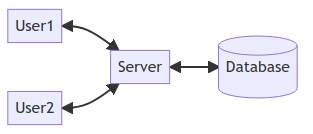
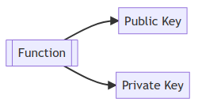
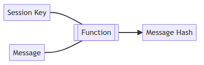
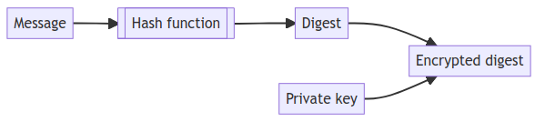
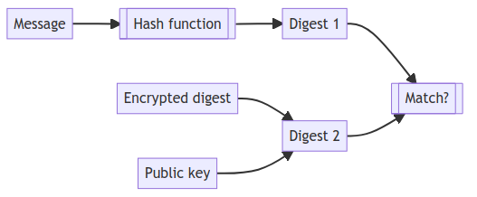
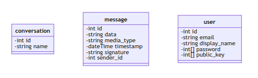
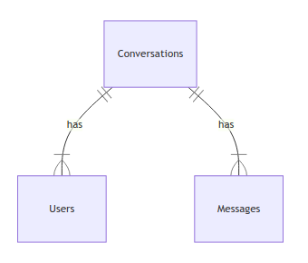

# Design

## Dependencies

The following libraries were used for features too complex, tedious, or irrelevant to implement myself. Since security is a major goal of this project, I have chosen to use professional and well-tested cryptographic algorithms instead of creating my own (likely insecure) versions.

### Server

- **argon2** to hash user passwords
- **async-std** to allow code to run asynchronously
- **async\_tls** and **rustls** to establish secure TLS connections
- **base64** to decode binary data
- **dotenv** to simplify configuring the application
- **env\_logger** and **log** for more informative logging
- **getrandom** for generating random data
- **sqlx** for interacting with a database
- **serde** for converting data from JSON

### Client

- **Flutter** for building the GUI
- **path\_provider** to access the filesystem
- **cryptography\_flutter** for encrypting data across multiple platforms

## Design decisions

One of the objectives for this project is to be cross-platform. It is not feasible to create a native client for every individual platform due to time constraints and duplicated effort. As an alternative, I have chosen a UI toolkit called Flutter which I can use to create native applications for iOS, Android, and the web.

A centralised server will be used to simplify data management and allow communications to happen easily across multiple clients.



The server will be written in the Rust programming language due to its strict memory checking features, good performance, and multithreading support. I believe these properties complement the server's role well since speed and reliability is crucial for such a component. The client will be written in Dart because this is the language used by the Flutter toolkit. When the program is compiled, this code will be converted to each platform's native language (Java/Kotlin for Android, Swift for iOS, and JavaScript for the web).

At the core of the system lies the asymmetric method of encryption. Each user will generate a pair of keys: one for encrypting messages (the public key) and one for decrypting them (the private key). This system makes cracking very difficult but can be slow due to its complexity. The private key will be kept locally on the user's device while the public key will simply be stored on the remote database.

The specific algorithms I will use are x25519 for encryption and ed25519 for signing. These both come from the elliptic-curve family of algorithms which, compared to Rivest-Shamir-Adleman (RSA), are fast at converting data and use very small key sizes for the same degree of security. This is significant because my application will largely be used on mobile phones which may not have powerful hardware. My reason for choosing these two over other elliptic-curve algorithms is that they are implemented in almost all languages, making it easier to implement new clients in the future if required.



To solve the speed problem, I will use an independent 'session key' to encrypt and decrypt individual messages. It is derived from the key pairs, hence it inherits a lot of the benefits of asymmetric cryptography while being much faster and less computationally-expensive.

The session key is derived from the recipient's private key and the sender's public key. The benefit of this approach is that the key does not need to be passed over a network, reducing transmission overhead and making it completely immune to man-in-the-middle interception.



As an extra layer of security against man-in-the-middle attacks, the program verifies the sender of each message using a digital signature. This is created by encrypting the digest (hashed version of message) with the sender's private key and sending it along with the message.



Once the user receives the message, they can create their own hash and compare it to the decrypted form of the digest they received (using the sender's public key).



## Operation

When the client initialises, it creates a persistent TLS connection with the server which will stay open until the app is closed. This simplifies communication because the server does not have to keep track of who connects to it or initiates connections with it; clients simply request the information they need through the existing connection without any additional authentication necessary.

Clients will encode messages in JSON form (due to its ubiquity as a data exchange format) and send them over a secure TLS connection. The server has no knowledge of the precise contents of the messages it receives and will only move them in and out of the database. This keeps the data secure even if the server was to be compromised.

On the server, a TCP listener is bound to port 63100 (not used in any major software). It accepts incoming connections asynchronously and continuously polls the client (every 500 ms, by default) in order to maintain a connection and acknowledge requests. Upon initialisation, it connects to a PostgreSQL database and accesses it according to the client's requests.

Data sent over the network follows a custom JSON-based protocol which specifies a function along with necessary operands:

```
{
  'function': 'CREATE USER',
  'email': 'john@example.com',
  'password': 'p@$$w0rd',
  'publicKey': 'VGhpcyBpcyBhIHN0cmluZyB1c2VkIGluIHRoZSBFY2hvIGRvY3VtZW50YXRpb24='
}
```

The function is made up of an operation and a target. The five possible operations include all the CRUD actions and an additional one called VERIFY.

The function is made up of an operation and a target. All the operations (excluding VERIFY) correspond to a CRUD action. JSON was chosen because of its ubiquity as a data exchange format. Although the password is sent in plaintext, security is not compromised because the server communicates through secure TCP connections.

JSON was chosen because of its ubiquity as a data exchange format. Base64 is used to encode binary data because it is more concise than a byte array (less data to transfer over the network) and quite popular for this purpose.

## Process

### Client

#### Sending

1. Exchange key pairs
    1. User1 generates a key pair
    2. User2 generates a key pair
    3. User1 sends their public key to User2
    4. User2 sends their public key to User1
2. Establish a session key
    1. Local private key combined with remote public key to create session key
3. Compose message
4. Encrypt the message
    1. User1 writes a message
    2. Create a signature
        1. Message contents are hashed to produce a digest
        2. User1 encrypts the digest using their private key
    3. Message encrypted using the session key
    4. Encrypted message and digest are bundled together
5. Transmit message to server

#### Receiving

1. Receive message
    1. User2 decrypts message using the session key
2. Verify signature
    1. User2 decrypts digest using User1's public key to produce first digest
    2. Message contents hashed to produce the second digest
    3. Check if digests match
3. Display message
    1. If signature could not be verified, display a warning to the user

### Server

1. Receive message
2. Interpret client request
  - If registering, add user information to database
  - If receiving a message, add it to database and relay it to user
3. Transmit message to User2

## Security

Most data (including messages) is encrypted before being sent to the server. This means the server has no precise knowledge of what it receives and stores it in scrambled form. As a result, the client is the only one who ever sees the plaintext version; no sensitive data is ever transferred over the network or stored in the database.

The exception to this is public information which doesn't benefit from encryption and certain metadata which is useful for the server to correctly identity the information it manages. For example, public keys or the members present in a conversation.

Since the server's API is public, anyone can, in theory, create their own client for this program. As a result, it cannot be assumed that passwords have been hashed prior to transmission and hence this is done on the server. To retain security, the exchange of data happens over a secure TLS connection which keeps passwords safe in transmission and adds an additional layer of protection against man-in-the-middle attacks.

## Classes



Since I want the program to support arbitrary data formats (like images or video) and not only plaintext, a `media_type` is specified for each message. This is formatted in standard MIME format so that clients are able to properly interpret the data.

## Database structure



A `participant` is an identity of a user that is specific to a certain conversation.

- Users
    - **ID**
    - Email
    - PublicKey
    - Password
    - Salt
- Messages
    - **ID**
    - Data
    - MediaType
    - Timestamp
    - Signature
    - Sender: Participants[ID]
- Participants
    - **ID**
    - Name
    - User: Users[ID]
    - Conversation: Conversations[ID]
- Conversations
    - **ID**
    - Timestamp

## Functions

### Client

```
Keyring.genKeys()
Keyring.createExchangePair() -> exchangeKeyPair
Keyring.createSigningPair(localPrivateKey, remotePublicKey) -> signingKeyPair
Keyring.createSessionKey(localPrivateKey, remotePublicKey) -> sessionKey
Keyring.import()
Keyring.export()

Message.initialize(data, mediaType, sessionKey, signingKeyPair)
Message.convert(data, sessionKey) -> data
Message.sign(privateKey) -> signature
Message.verifySignature(signingKeyPair) -> bool
Message.send()

DataSocket.initialize(hostname)
```

### Server

```
handle_connection(stream, tlsAcceptor, dbPool)
handle_request(data, dbPool, user)
init_db() -> dbPool

Request.from_json(data)
RawRequest.decode()

Tls.get_acceptor() -> tlsAcceptor
Tls.get_cert(path) -> certificate
Tls.get_key(path) -> privateKey

Password.hash(password, salt) -> password
Password.is_valid(password) -> bool

Settings.is_enabled() -> bool
```
