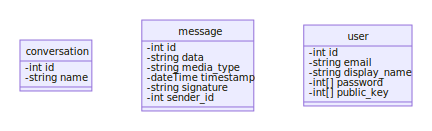
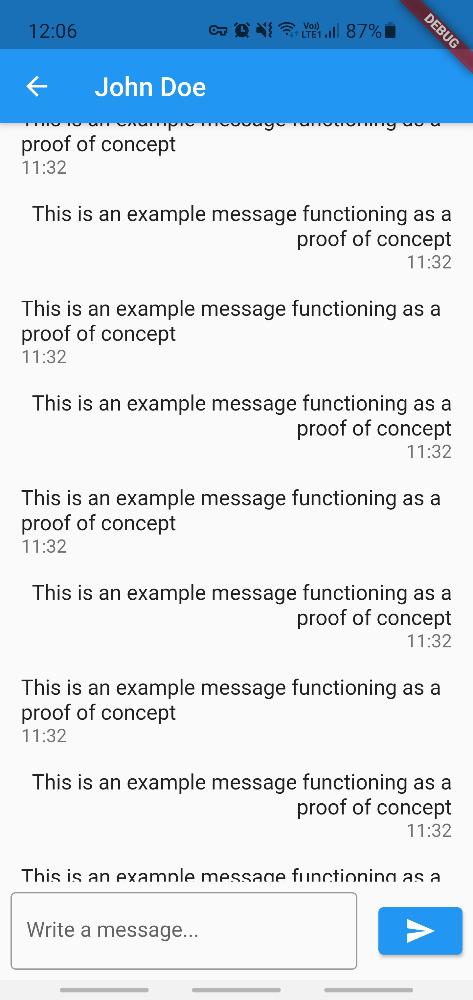

# Design

## Dependencies

The following libraries were used for features too complex, tedious, or irrelevant to implement myself. Since security is a major goal of this project, I have chosen to use professional and well-tested cryptographic algorithms instead of creating my own (likely insecure) versions.

One of the objectives for this project is to be cross-platform. It is not feasible to create a native client for every individual platform due to time constraints and duplication of effort. As an alternative, I have chosen a UI toolkit called Flutter which I can use to create native applications for iOS, Android, and the web.

### Server

- **argon2** to hash user passwords
- **async-std** to allow code to run asynchronously
- **async-tls** and **rustls** to establish secure TLS connections
- **base64** to decode binary data
- **dotenv** to simplify configuring the application
- **env-logger** and **log** for more informative logging
- **getrandom** for generating random data
- **sqlx** for interacting with a database
- **serde** for converting data to and from JSON

### Client

- **flutter** for building the GUI
- **cryptography-flutter** for encrypting data across multiple platforms
- **path-provider** to access the filesystem

## Algorithms

## Security

Most data (including messages) is encrypted before being sent to the server. This means the server has no precise knowledge of what it receives and stores it in scrambled form. As a result, the client is the only one who ever sees the plaintext version; no sensitive data is ever transferred over the network or stored in the database. The exception to this is public information which doesn't benefit from encryption and certain metadata which is useful for the server to correctly identity the information it manages. For example, public keys or the members present in a conversation.

Since the server's API is public, anyone can, in theory, create their own client for this program. As a result, it cannot be assumed that passwords have been hashed prior to transmission and hence this is done on the server. To retain security, the exchange of data happens over a secure TLS connection which keeps passwords safe in transmission and adds an additional layer of protection against man-in-the-middle attacks.

### Asymmetric encryption

At the core of the system lies the asymmetric method of encryption. Each user will generate a pair of keys: one for encrypting messages (the public key) and one for decrypting them (the private key). This system makes cracking very difficult but can be slow due to its complexity. The private key will be kept locally on the user's device while the public key will simply be stored on the remote database.


The specific algorithm I will be using is X25519. This is an elliptic-curve-based algorithm which, compared to Rivest-Shamir-Adleman (RSA), is fast at converting data and uses very small key sizes for the same degree of security. This is significant because my application will largely be used on mobile phones which may not have powerful hardware. The reason I chose this over other forms of elliptic-curve cryptography is that it is implemented in almost all languages, making it easier to implement new clients in the future if required.

### Symmetric encryption

To solve the speed problem, I will use an independent 'session key' to encrypt and decrypt individual messages. It is derived from the key pairs, hence it inherits a lot of the benefits of asymmetric cryptography while being much faster and less computationally-expensive.

The session key is derived from the recipient's private key and the sender's public key. The benefit of this approach is that the key does not need to be passed over a network, reducing transmission overhead and making it completely immune to man-in-the-middle interception.


#### X25519

X25519 is a 128-bit Diffie-Hellman function based on the Curve25519 elliptic curve.

Being a Diffie-Hellman function, X25519 exchanges keys asymmetrically. Each member of the exchange generates a private key and a public key, but both can combine their private key with the other's public key and obtain the same result: a shared secret. This shared secret, once established, can be used a key for ordinary symmetric encryption.

1. Each user starts with a 32-byte private key.
2. A corresponding 32-byte public key is created by passing the private key and public string 9 into a Curve25519 function.
3. Shared secret can be computed by combining one user's public key with another user's private key.

Mathematically, Curve25519 uses the Montgomery curve `y^2 = x^3 + 486662x^2 + x` over the prime field defined by the prime number `2^255 - 19`. Montgomery curves are a type of elliptic curve, and they all have an equivalent twisted Edwards curve; in the case of X25519, the Edwards curve is Ed25519 and is used for signatures.

### Signatures

As an extra layer of security against man-in-the-middle attacks, the program verifies the sender of each message using a digital signature. This is created by encrypting the digest (hashed version of message) with the sender's private key and sending it along with the message.



Once the user receives the message, they can create their own hash and compare it to the decrypted form of the digest they received (using the sender's public key).


I will use the Ed25519 algorithm for signing. This is another elliptic-curve-based algorithm which serves as a counterpart to X25519 and was chosen for the same reasons.

#### Ed25519

Ed25519 is the birationally equivalent twisted Edwards curve for Curve25519. Since the two are linked, Ed25519 is used to create signatures for secrets made with X25519.

A nonce (number used once) is a secret value used for every signature to keep the private key unknown.

## Data structures

## Classes



Since I want the program to support arbitrary data formats (like images or video) and not only plaintext, a `media_type` is specified for each message. This is formatted in standard MIME format so that clients are able to properly interpret the data.

### Client

```
Keyring.genKeys()
Keyring.createExchangePair() -> exchangeKeyPair
Keyring.createSigningPair(localPrivateKey, remotePublicKey) -> signingKeyPair
Keyring.createSessionKey(localPrivateKey, remotePublicKey) -> sessionKey
Keyring.import()
Keyring.export()

Conversation.fromJson(json) -> Conversation

Message.fromJson(json) -> Message
Message.compose(data, mediaType) -> Message
Message.fetch(conversationId) -> List<Message>
Message.convert(data, sessionKey) -> data
Message.sign(privateKey) -> signature
Message.verifySignature(signingKeyPair) -> bool
Message.send()

User.fromJson(json) -> User
User.register()
User.login()

Server.connect(hostname)
Server.write(data)
Server.listen() -> List<int>
```

### Server

```
handle_connection(stream, tlsAcceptor, dbPool)
handle_request(data, dbPool, user)
format_response(response) -> String
init_db() -> dbPool

User.from_json(data)
Message.from_json(data)
Conversation.from_json(data)

Request.from_json(data)
Request.verify_users(login, dbPool) -> Response
Request.create_users(login, dbPool) -> Response
Request.create_conversations(login, dbPool) -> Response
Request.create_messages(login, dbPool) -> Response
Request.read_conversations(login, dbPool) -> Response
Request.read_messages(login, dbPool) -> Response
Request.read_users(login, dbPool) -> Response

Response.to_json() -> String
Response.users_to_json() -> String
Response.messages_to_json() -> String
Response.conversations_to_json() -> String

Tls.get_acceptor() -> tlsAcceptor
Tls.get_cert(path) -> certificate
Tls.get_key(path) -> privateKey

Login.authenticate(email)

Password.hash(password, salt) -> password
Password.is_valid(password) -> bool

Settings.is_enabled() -> bool
```

## File structure

### Client

The client file structure looks like this:

```
.
├── conversation.dart
├── keys.dart
├── main.dart
├── message.dart
├── pages
│   ├── conversations.dart
│   ├── login.dart
│   ├── messages.dart
│   └── settings.dart
├── response.dart
├── server.dart
└── user.dart
```

App pages are stored under their own `pages` directory to keep the UI and logic mostly separate and avoid naming conflicts.

- `conversation.dart`, `message.dart` and `user.dart` are the three primary classes used by Echo
- `keys.dart` contains cryptographic details and manages the public and private keys of a user
- `server.dart` has a class representing the server. It it in the global state and contains some data used throughout the app.
- `response.dart` is used for representing raw server responses as a structured object.

### Server

The server file structure looks like this:

```
.
├── api
│   ├── request.rs
│   └── response.rs
├── api.rs
├── auth.rs
├── database.rs
├── lib.rs
├── main.rs
├── settings.rs
├── sql
│   ├── create-conversation-1.sql
│   ├── create-conversation-2.sql
│   ├── create-message.sql
│   ├── create-user.sql
│   ├── read-conversation.sql
│   ├── read-message.sql
│   ├── read-user.sql
│   ├── tables
│   │   ├── conversations.sql
│   │   ├── drop.sql
│   │   ├── messages.sql
│   │   ├── participants.sql
│   │   └── users.sql
│   └── verify-user.sql
└── tls.rs
```

The project mainly consists of a library `lib.rs`, with a thin wrapper `main.rs` for the executable. All database queries are stored as SQL files in an `sql` directory for organisation purposes.

- `api.rs`, `request.rs`, and `response.rs` implement the three primary data types used by Echo (conversations, messages, and users) and provide methods for storing/retrieving them from the database, converting them to and from JSON, reading requests, and formatting responses.
- `auth.rs` authenticates uses and manages their accounts. This is where passwords are hashed, salted, stored, and read.
- `database.rs` provides functions for initialising a database, setting up tables, and dropping tables.
- `settings.rs` provides helper functions for handling user settings.
- `tls.rs` provides functions to help in setting up a TLS connection.

## Database design


A `participant` is an identity of a user that is specific to a certain conversation.

- Users
    - **ID**
    - Email
    - PublicKey
    - Password
    - Salt
- Messages
    - **ID**
    - Data
    - MediaType
    - Timestamp
    - Signature
    - Sender: Participants[ID]
- Participants
    - **ID**
    - DisplayName
    - Identity: Users[ID]
    - Conversation: Conversations[ID]
- Conversations
    - **ID**
    - Name
    - Timestamp

## Queries

```sql
INSERT INTO conversations (name)
VALUES ($1)

INSERT INTO participants (identity, conversation)
VALUES (
    (SELECT id FROM users WHERE email = $1),
    (SELECT id FROM conversations WHERE name = $2)
)
```

These two queries create a conversation. The first creates the conversation itself and the second adds the initial users to it.

```sql
INSERT INTO messages (sender, data, media_type, timestamp, signature)
VALUES (
    (SELECT participants.id
    FROM participants
    JOIN users ON users.id = participants.identity
    JOIN conversations ON conversations.id = participants.conversation
    WHERE users.email = $1
    AND conversations.id = $2),
    $3, $4, $5, $6
)
```

This query creates a message in a conversation.

```sql
INSERT INTO users (email, public_key, pass, salt)
VALUES ($1, $2, $3, $4)
```

This query creates a user.

```sql
SELECT conversations.id, conversations.name
FROM conversations
JOIN participants ON participants.conversation = conversations.id
WHERE participants.identity = (
    SELECT id FROM users WHERE email = $1
)
```

This query lists all the conversations a user is in.

```sql
SELECT messages.data, messages.media_type, messages.timestamp, messages.signature, users.email
FROM messages
JOIN participants ON participants.id = messages.sender
JOIN users ON users.id = participants.identity
JOIN conversations ON conversations.id = participants.conversation
WHERE (conversations.id = $2)
AND ($2 IN (
    SELECT conversation
    FROM participants
    JOIN users ON users.id = participants.identity
    WHERE users.email = $1
))
```

This query lists all the messages in a conversation.

```sql
SELECT users.email, participants.display_name, users.public_key
FROM users
JOIN participants ON participants.identity = users.id
JOIN conversations ON conversations.id = participants.conversation
WHERE (conversations.id = $2)
AND ($2 IN (
    SELECT conversation
    FROM participants
    JOIN users ON users.id = participants.identity
    WHERE users.email = $1
))
```

This query lists all the users in a conversation.

```sql
CREATE TABLE conversations (
    id SERIAL PRIMARY KEY,
    name VARCHAR(50) UNIQUE NOT NULL,
    timestamp BYTEA
)
```

This query creates a table to store conversations.

```sql
DROP TABLE IF EXISTS messages, participants, conversations, users CASCADE
```

This query drops all existing tables.

```sql
CREATE TABLE messages (
    id SERIAL PRIMARY KEY,
    data BYTEA NOT NULL,
    media_type BYTEA,
    timestamp BYTEA,
    signature BYTEA,
    sender INT references participants(id) NOT NULL
)
```

This query creates a table to store messages.

```sql
CREATE TABLE participants (
    id SERIAL PRIMARY KEY,
    display_name VARCHAR(32),
    identity INT references users(id) NOT NULL,
    conversation INT references conversations(id) NOT NULL
)
```

This query creates a table to link users to conversations.

```sql
CREATE TABLE users (
    id SERIAL PRIMARY KEY,
    email VARCHAR(50) UNIQUE NOT NULL,
    public_key BYTEA NOT NULL,
    pass BYTEA NOT NULL,
    salt BYTEA NOT NULL
)
```

This query creates a table to store users.

## Human-computer interaction


The login screen is simple and doesn't immediately ask for much information. This should help new users get started quickly.


Three elements make up the conversations screen: a header bar, a list of conversations, and a navigation bar at the bottom. The navigation bar was positioned at the bottom because that is the location closest to the thumb, aiding ergonomics.

At the bottom of the list is a small button with a plus symbol on it which is used to start new conversations. This is a fairly traditional UI so it should be familiar to users.



Each conversation has a messages page with its name on the header bar to help the user keep track of who they are talking to. The bottom of the page has a persistent message box so that participants can start writing at any point in the conversation.

Yet again, this is a common design and users will likely immediately know what to do.

## Hardware selection

Since the client is cross-platform, it will work on most common devices. I will specifically test Android, Windows, and Linux since I have easy access to these operating systems.

For development, I'm hosting the server on a Raspberry Pi running Linux. This is because it is a small, cheap, and low-power device which allows me to keep it on for long periods of time to test its resilience and also make sure the server works fast even on weak hardware.
